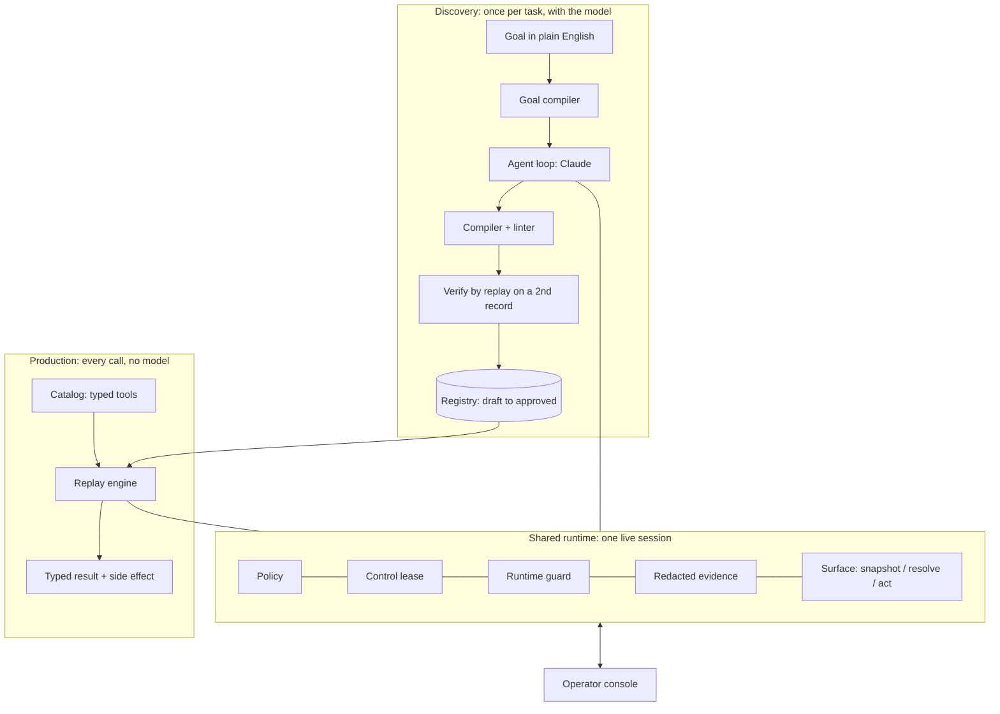

# Design report: computer-use capabilities

*Bindu Bhargava Reddy Chintam*

The model discovers; the artifact becomes a reusable capability; deterministic replay is how an agent invokes it. Everything below is built and tested (139 tests) unless it says *design only*. Evidence: [`evidence/`](evidence/README.md).

## Architecture

- **One runtime for both modes**: policy gate, control lease, runtime guard (known interruptions, bounded recovery), redactor, evidence log. A maintenance pop-up is handled identically in both, so it never enters a recorded flow.
- **Perception without a clean DOM.** An injected script builds an accessibility-style snapshot of every frame (roles, accessible names, the *proximity label* a person reads beside an unlabeled input, tables, red messages), plus a masked screenshot with ref marks. The model acts only on refs and never writes selectors; the runtime grounds each action into strategies proven in the page, at that moment, to hit exactly that element.
- **One resolver** validates at record time and targets at replay, so they cannot disagree. Playwright only dispatches real input, and is a test oracle: its `get_by_role` agrees with our names on 50 elements per tenant.
- **A hand-written loop on Claude Opus 5** (adaptive thinking logged as the "why", strict tools, one call per turn, prompt caching, refusal fallback, append-only history, runtime notes as `role: system`), because every action must pass policy, lease and guard.
- **Trade-offs**: one process and YAML files reviewed like code, not services and a database; our own resolver, which ports to desktop accessibility APIs, at the cost of owning name computation (hence the oracle).

## Artifact schema

A capability (`capabilities/<product>/<id>/<version>.yaml`, [JSON Schema](schemas/capability.schema.json)) has two halves. The real discovered ones are in [`capabilities/`](capabilities/).

- **`contract`, what a caller relies on**: typed inputs (pattern or enum, and a *sensitivity* that drives redaction), typed outputs (`money` is a decimal string plus currency; tables have typed columns), every business **outcome** it can return with caller guidance (including the engine's own `APPROVAL_DENIED` and `OUTPUT_NOT_PRESENT`), `effects`, and an example call. Tools are generated from it; overlays never touch it; breaking it is a MAJOR version.
- **`implementation`, how it runs**: product and version range, tenant-relative entry, ordered steps (stable id, intent, action, effect `read`/`input`/`commit`, target, value `{param}`/`{secret}`/`{literal}`, `pre` and `expect` checkpoints, timeout, provenance), outcome detectors that reference the product's message catalog, and a success condition.
- **Targets** are a container path plus ordered strategies, each proven unique at record time:

| Strategy | Matches | UIA equivalent |
|---|---|---|
| `role_name` | role + accessible name | ControlType + Name |
| `label` | explicit or proximity label | LabeledBy |
| `table_cell` / `table` | header set + row key + column | Grid / Table patterns |
| `attr` | stable attributes (generated ids rejected) | AutomationId |

  **Outputs are never located by their own value.** The discovered balance is "column *Balance* in the row where *Description* is PRIMARY SAVINGS", which is correct for another member and for tenant B's reordered columns. Text and CSS paths live only in a diagnostic fingerprint.
- **Checkpoints** are a small language: `document_changed` (a per-document nonce; legacy postbacks keep the URL), `text_visible` (whole tokens), `field_value`, `url_matches`, `element_present`, `outputs_present`, `all_of`/`any_of`. A commit's `pre` checks read each input from its labelled field on the review page and compare exactly (money as numbers). Landmarks must not be data and must survive verify-by-replay on a second record.
- **Review**: approval records the content hash, so any edit turns the artifact back into a draft; `provenance` records the run, model, trace hash and verifying runs, never the transcript.

## Determinism & error handling

Replay imports no model (a test blocks the SDK). **Pre-flight touches nothing**: inputs, policy, approvals (capability *and* overlays on production), version range. **Every wait is a race** between the expected state, every known runtime condition (dialogs, session expiry, server error, maintenance overlay, supervisor override, entitlement, declared outcomes, new red text) and a timeout. Anything unknown **fails safe**.

| Class | Examples in the mock | Replay | Result |
|---|---|---|---|
| Business outcome | no such member, restricted account, no savings row, operator declined | stop cleanly | `business_outcome` + code + guidance |
| Recoverable | maintenance pop-up, info alert, session timeout, transient 500, slow page | bounded handler; sign on again and **re-drive only before any commit** | continues; `recoveries[]` |
| Needs a human | supervisor PIN, unapproved commit, unrecoverable state with an operator connected | live handoff, or park | `needs_human`, or continues |
| Hard failure | drift, unknown page or pop-up, persistent 500, missed vendor upgrade, bug | stop with masked screenshot, redacted snapshot, near-misses | `failed` + step, expected, observed |

**Every result carries `side_effect`** (`none`, `not_committed`, `committed`, `unknown`) and `retry_safe`; `error.transient` is never true when a retry could apply a change twice. **A commit is dispatched at most once**: it is written ahead before the click, never retried, re-driven or re-clicked after a hand-back (a regression test fails without this guard); it must match by its primary locator or by two strategies that agree; a step recorded as a read that now resolves to a commit control is blocked. If the answer never arrives, the result is `unknown` (evidence scenario 15).

Drift is detected, not just survived: `FALLBACK_LOCATOR_USED` warnings, near-miss hints naming the step to re-target, and overlays re-selected from the version the app reports (a mismatch that changes the plan stops the run). **Determinism is checked**: all 15 evidence scenarios ran twice with identical results and step paths.

## Heterogeneity & multi-tenant

**The seam is the `Surface` protocol** (snapshot, resolve, act, read, masked screenshot; opaque element handles). Runtime, engine, checks and agent are typed against it, and the artifact never mentions the DOM.
- **Legacy web** is what is built: framesets, layout tables, unlabeled inputs, random ids, red-text errors.
- **Desktop** *(design)*: UI Automation or AX tree as the snapshot, window/pane paths as containers, the same strategy kinds, Invoke/Value patterns as actions.
- **Pixel-only / VDI** *(design)*: OCR plus element detection as the snapshot, strategies resolved against text anchors, coordinate actions, and Claude's computer-use tool for discovery.

**Reuse is layered**: an app profile per vendor product (auth, detectors, message catalog, sensitive labels, risk rules); capabilities per product and version range; **version overlays** shared by every tenant on a release (they re-target steps by id and map enum labels, never re-route or touch the contract or a commit's checks, and are approved like capabilities); a small tenant config. A vendor change costs one patch per affected step per release, never one per tenant; the effective-plan hash covering all of it is on every result.

**Demonstrated**: the discovered artifact fails on tenant B (AcmeCore 7.3) with a precise drift report, then succeeds with the shared overlay; *Search* degrades to its attribute fallback with a warning, and the balance is still right despite reordered columns.

## Escalation & handoff

**Stuck** means: in discovery, budget spent, three failed actions, no page change for four, a repeated action, repeated policy denials, or the model asks; in replay, a human-required detector (supervisor PIN), an unapproved commit, or an unrecoverable condition while an operator is connected.

**The intervention request** carries the capability or goal, the step and its intent, why it stopped, the proposed action, what "done" looks like, a masked screenshot, a redacted excerpt, allowed decisions and a deadline; with no operator it **parks** (`needs_human`). **Control is a lease with an epoch** (`AUTOMATION → AWAITING_HUMAN → HUMAN → AUTOMATION`, or `CLOSED`): every automated action checks it, so automation never acts on a stale decision, and real input in the window is an implicit takeover. The console (localhost, mock auth) offers Approve, Reject, Take control, Hand back with a note, and Abort, and shows who holds control. **Take control hands over the same headed browser session**; the person's clicks and changes are recorded with validated targets, secret fields (the PIN) are never captured, and a page dialog is theirs to answer.

**On hand-back replay re-checks, never assumes**: checkpoint holds → `completed_by_human`; control present and not a dispatched commit → retry; else `RESYNC_FAILED`. At a deadline it inspects the page before reporting, and human actions pass the same effect classification, so a commit by hand is never reported as "nothing happened". *Not built*: remote co-browsing, durable queues and SLAs, operator auth, parked sessions surviving a restart.

## Safety

- **Allowlist, enforced twice**: policy (tenant origins, path globs, action types) at pre-flight and on every action, and a network guard blocking everything else, including the mock's `/__admin` fault hooks; no service workers, downloads or uploads.
- **Risky actions**: effects are `read`, `input` or `commit`. A control is a commit by name, by submitting (natively or by script) to a commit route, or by linking to one; reviewers can raise a class, never lower it. **Every commit needs explicit approval** (operator, or invocation `--approve`); production runs only approved artifacts and overlays; discovery refuses production tenants. Why block rather than flag: a wrong read is recoverable, a wrong write may not be; flagging notices too late, and blocking everything makes writes useless.
- **Data**: the model never signs on or sees credentials; it sees inputs as `{{placeholders}}`, PII (by label or column header) as `<pii:…>`, money as `$#,###.##`. Screenshots are masked twice (CSS over sensitive cells, painted boxes over exact values) or not taken; logs keep keyed digests of confidential outputs; the linter fails closed on concrete inputs, secrets, PII, money in targets and unchecked commits; no Playwright traces. `scripts/audit_evidence.py` scans everything published for `.env` secrets and the mock's whole synthetic PII set (a planted-leak test proves it).
- **Limits**: masking is label- and pattern-based and pixels are not OCR-audited; discovery needs sandbox data and a zero-retention endpoint; page text is untrusted, so the defence is policy plus the commit gate, not the prompt; page scripts could forge capture events, so human steps are review-only; approvals are recorded hashes, not signatures.

## Cuts

**Cut deliberately**: desktop and pixel surfaces (designed above), remote co-browsing and durable queues, operator auth, parked sessions surviving a restart, tenant-specific overlays, OCR-based evidence audit, and an optional screen recording (raw video cannot be masked).

**Stretch goals built**: *cross-tenant reuse* (approved version overlays, drift report, graceful degradation) and an *agent-facing catalog* (`cua catalog export|ask`: strict tools generated from contracts, the model in the calling agent, execution by replay). Multi-run stability is part of the tests and evidence rather than a feature.

**Next**: a product-level control map, canary replays and drift dashboards per tenant, overlay suggestions learned from human interventions, negative-path discovery probes so outcome detectors are learned rather than declared, durable sessions and queues, and a UI Automation surface as the second implementation of the seam.
