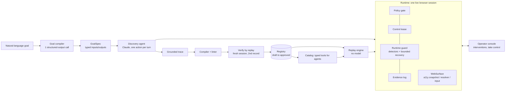

# Design report: computer-use capabilities

The model discovers. The artifact becomes a reusable capability. Deterministic replay is how an agent invokes it in production. This report explains the decisions behind that and where each one stops.

## Architecture

- **One process, one live session per run.** The mock bank runs as a separate process. Discovery and replay share the same runtime (policy, control lease, runtime guard, redactor and evidence log), so a known interruption such as a maintenance pop-up is handled identically in both modes. Because discovery recovers it the same way, it never gets recorded into the flow.
- **The model only acts on refs from the latest observation; it never writes selectors.** Each observation has two parts:
  - an accessibility-style snapshot of every frame (roles, accessible names, *proximity labels* such as "Member #:" in the neighbouring cell, values, tables);
  - a masked screenshot with ref marks.

  When it acts, the runtime grounds the element into candidate strategies. Each one is validated **in the page, at that moment**, to resolve to exactly that element.
- **One resolver.** `cu_bundle.js` is the only way a target is found, both at record-time validation and at replay, so the two can never disagree. Playwright dispatches the real input events and serves as a test oracle for role and name.
- **I own the loop.** It's a hand-written tool-use loop on Claude Opus 5: adaptive thinking whose summaries are logged as the "why", strict tools, parallel tool use disabled, prompt caching, and server-side refusal fallback. Every turn must pass policy, then the lease, then the guard, and it is logged.
- **Trade-offs.**
  - Everything runs in one process instead of services with a queue. The intervention broker, registry and evidence store are clean interfaces, but local.
  - The artifacts are YAML files reviewed like code, not a database.

## Artifact schema

A capability (`capabilities/acmecore/<id>/<version>.yaml`, JSON Schema in `schemas/`) has two halves.

**`contract`: what a caller relies on.**
- **Inputs** are typed, with pattern or enum, and carry a *sensitivity* that drives redaction.
- **Outputs** are typed: `money` is `{amount: decimal string, currency}`, and a `table` has typed columns.
- **Outcomes** are declared business outcome codes, each with `caller_guidance` and `retry_safe`, e.g. `MEMBER_NOT_FOUND`.
- **`effects`** is `read_only` or `commit`, plus `idempotent`.
- **An example call** is included.

Overlays can never change the contract. Breaking it is a MAJOR version bump.

**`implementation`: how it runs.**
- **App binding:** vendor product + version range.
- **Entry route:** tenant-relative.
- **Steps:** each has
  - a stable `id`
  - an `intent`
  - an `action`
  - an `effect`: `read`, `input` or `commit`
  - a `target`
  - a `value`: `{param}`, `{secret}` or `{literal}`
  - `pre` (commit only) and `expect` checkpoints
  - optional `on_dialog`
  - `timeout_ms`
  - `provenance`: agent, human or author
- **Outcome detectors:** references into the app profile's message catalog.
- **A final `success` condition.**

**Targets.** A target is a container path plus ordered strategies:

| Strategy | What it matches | UIA equivalent |
|---|---|---|
| `role_name` | role + accessible name | ControlType + Name |
| `label` | proximity/explicit label | LabeledBy |
| `table_cell` / `table` | header set + row-key column + column header | Grid/Table patterns |
| `attr` | stable attributes; generated-looking ids are rejected | AutomationId |

Visible text and CSS paths live only in a diagnostic `fingerprint`. **Outputs are never located by their own value**: a balance cell is "column *Balance* in the row where *Description* = PRIMARY SAVINGS". That's what makes the same artifact correct for a different member, and for tenant B's reordered columns.

**Checkpoints** form a small condition language:
- `document_changed`: a per-document nonce, because legacy postbacks keep the same URL;
- `text_visible` / `text_matches`;
- `field_value`;
- `url_matches`;
- `element_present`;
- `outputs_present`;
- `all_of` / `any_of`.

Every navigating step asserts a new document plus a landmark. The compiler keeps a landmark only if it isn't data (no PII, inputs, outputs or numbers) and it survives verify-by-replay on a second record.

**Versioning and review.**
- `status` moves from `draft` to `approved`.
- Approval signs a content hash that excludes `status` and `approval`, so editing an approved file silently turns it back into a draft.
- `provenance` records the discovery run, model, trace hash and verifying runs. It never holds the transcript.

## Determinism & error handling

Replay imports no model; a test runs it with the `anthropic` package blocked.

**Pre-flight touches nothing.** It checks inputs against the contract, policy, approval and version compatibility. A failure returns `rejected`.

**Every wait is a race** between the state we expect, every known runtime condition and a timeout, polled every 250 ms. The known conditions are checked in precedence order:
1. native dialog
2. session expired
3. server error
4. maintenance overlay
5. supervisor override
6. entitlement denied
7. declared business outcomes
8. new red text

"Frame navigating" means *not ready yet*, never failure. Any unrecognized message or dialog **fails safe** (`UNRECOGNIZED_STATE`), and only after re-checking the known conditions on a settled page.

| Class | Examples (mock) | What replay does | Result |
|---|---|---|---|
| Business outcome | member not found, restricted account, app validation, operator rejected a commit | stop cleanly | `business_outcome` + code + caller guidance |
| Recoverable | maintenance pop-up, informational alert, session timeout, transient 500, slow page | bounded handler: click a known control / accept / sign on again + **re-drive from the entry route** (only if nothing committed) / keep waiting | continues; listed in `recoveries[]` |
| Needs a human | supervisor PIN, commit without approval, stuck | escalate on the live session, or park | `needs_human` (parked), or continues after hand-back |
| Hard failure | control missing on the expected page (drift), expected page never came, unknown page/message, persistent app error, entitlement denied, auth failure, session lost | stop with masked screenshot, redacted snapshot and near-miss hints | `failed` + `error{code, step, expected, observed, retryable, hint}` |

**Every result reports `side_effect`:** `none`, `not_committed`, `committed` or `unknown`, plus `retry_safe`. After any failure on a write flow, the caller's first question is "did it commit?".

**Commit steps get extra protection:**
- They run only if the review page echoes every input (`pre`).
- The target must match by its primary strategy, or by two strategies agreeing on the same element.
- The element is re-classified live: a step recorded as a read that now resolves to a commit-class control is blocked.
- They are never retried, and reload is never a recovery, because it can re-submit a POST.

**Drift is secondary here, but it is detected.**
- A fallback locator produces a `FALLBACK_LOCATOR_USED` warning.
- A missing control produces `TARGET_NOT_FOUND`, with near-miss candidates ("link 'Member Lookup', similarity 0.50") and a hint naming the step to re-target.
- The banner's product version is compared with the tenant config.

**Determinism is tested.** Every success scenario runs twice and must produce the same step trace, and the repo has 27 integration tests over real browser sessions.

## Heterogeneity & multi-tenant

**The seam is the `Surface` protocol:** snapshot, resolve, act, read and masked screenshot. Only the web implementation exists. The artifact never mentions the DOM: containers are paths (frames on web, windows and panes on desktop), and strategies are the accessibility concepts above.
- **Legacy web** is what's built: framesets, layout tables, unlabeled inputs, random ids.
- **Desktop** maps onto UI Automation / AX with the same strategy kinds; actions go through Invoke/Value patterns.
- **Pixel-only surfaces** (Citrix/VDI) need a snapshot from OCR plus element detection, strategies resolved against OCR text anchors, coordinate actions, and discovery through Claude's computer-use tool.

The artifact, the replay engine and the error taxonomy stay the same across all three; only the surface changes.

**Reuse across tenants** is layered:
1. The **app profile** holds vendor-product knowledge shared by every tenant: auth procedure, runtime detectors, message catalog, sensitive labels, risk rules.
2. **Capabilities** are scoped to product + version range, with tenant-relative routes.
3. **Version overlays** are shared by all tenants on that release, so cost grows as N capabilities + M overlays rather than N × tenants. An overlay patches `implementation` steps by id. It can **re-target but not re-route**: no adding, removing or reordering steps, and never the contract.
4. The **tenant config** holds base URL, product version, environment, secret references and policy.

The effective plan hash covers the capability, overlays, app profile and policy, and every result reports it.

**Built and demonstrated:**
- Tenant B runs AcmeCore 7.3, which renamed and moved a menu item, relabelled Search as Find, and reordered and extended the shares table.
- Without the overlay, the run fails with a precise drift report.
- With the shared 7.3 overlay (a one-step patch), it succeeds. The Search step degrades gracefully to its attribute fallback and raises a drift warning, and the balance is still read correctly because extraction is header-based.
- The *discovered* artifact generalizes the same way (tested).

**Design only:**
- tenant-specific overlays;
- a nightly canary replay per tenant and capability after vendor upgrades, alerting on warnings;
- turning recorded human interventions into suggested overlay patches.

## Escalation & handoff

**Detecting that a run is stuck:**
- *Discovery:* step or time budget reached, three consecutive failed actions, no page change for four actions, the same action three times, repeated policy denials, or the model calling `request_human`.
- *Replay:* a `human_required` detector (supervisor PIN), a commit needing approval, or an unrecoverable condition after a commit (a re-drive is not allowed then).

**The intervention request** carries:
- the capability or goal and the step (id and intent);
- why it stopped and the proposed action;
- a masked screenshot and a redacted page excerpt;
- the allowed decisions and a deadline.

It is saved with the run and routed to an operator. With `--operator none` it **parks** and returns `needs_human`, which is queue-style routing.

**Control transfer** is a lease with an epoch counter:
- States: `AUTOMATION` → `AWAITING_HUMAN` → `HUMAN` → `AUTOMATION` (or `CLOSED`).
- Every automated action runs inside `automated_action(epoch_seen)` and refuses if control moved since the decision was made, so automation can never fight a person.
- Real input arriving while automation holds the lease is an *implicit takeover*, and automation yields.

**The operator console** (localhost, mocked auth) lets the operator Approve, Reject, Take control, Hand back with a note, or Abort, and shows who holds control. **Take control** hands over the *same* headed browser session.

**Human actions are captured** by the injected script:
- only trusted input events count;
- each click or change carries candidate targets validated at event time;
- values typed into secret fields (password, PIN) are never captured.

**On hand-back, replay re-syncs; it never assumes:**
- if the current step's checkpoint now holds → `completed_by_human`;
- else if its control is present → retry the step;
- else → `RESYNC_FAILED`.

The headline run is the supervisor-PIN override on a large deposit:
1. The commit is dispatched and the detector fires.
2. The operator takes control, types the PIN (not captured) and approves.
3. They hand back.
4. Replay verifies the receipt, extracts the confirmation number, and reports `side_effect: committed` with the human actions in `interventions[]`.

**Not built:**
- remote co-browsing (CDP screencast/VNC to a remote operator);
- durable queues with routing and SLAs;
- operator auth/RBAC;
- keeping a parked session alive across a process restart (this prototype reports `session_retained: false`).

## Safety

- **Allowlist enforced twice:**
  - The policy (origins from the tenant base URL, path globs, action types) is checked at pre-flight and on every action.
  - A **network guard** (`context.route`) blocks any non-allowlisted request, including the mock's `/__admin` fault hooks. Service workers are blocked, and downloads and uploads are off.
- **Effect classes:** `read`, `input` (reversible until submitted) and `commit` (risky/irreversible).
  - The class is the maximum of the app-profile control/route rules, name heuristics and the recorded effect. A reviewer can raise it but never lower it.
  - **Every commit needs an explicit approval.** In discovery that is an operator decision. In replay it is an operator decision or the invocation's `--approve`.
  - **Production tenants run only approved artifacts.**
  - Why: a wrong read is recoverable and a wrong write may not be. Flagging only notices after the fact, and blocking everything makes write flows useless.
- **Credentials:**
  - The model never signs on and never sees credentials; deterministic auth resolves secret references at runtime.
  - Secret values are scrubbed from every string written anywhere.
- **PII and money:**
  - The model sees inputs as `{{placeholders}}`, values next to sensitive labels as `<pii:…>`, and money as `$#,###.##`.
  - Screenshots are masked in two layers: CSS over sensitive elements, including inner frames, and painted boxes over exact substrings. If masking can't be confirmed, no screenshot is taken.
  - Logs hold only digests of confidential outputs.
  - The artifact linter fails closed on concrete input values, secrets, PII shapes or money anywhere in an artifact.
- **Evidence hygiene:**
  - Playwright traces are excluded (they store typed values and cookies).
  - `scripts/audit_evidence.py` (also in CI) scans everything published for `.env` secrets and the mock's entire synthetic PII set. A deliberately planted leak makes it fail.
- **Limits:**
  - PII masking is pattern- and label-based and best-effort.
  - Discovery should run only on sandbox tenants with synthetic data, and against a zero-retention model endpoint; only replay touches production.
  - The prompt tells the model page text is untrusted, but the real defence is the policy and commit gates.
  - Page JavaScript could forge capture events, so human-recorded steps are always review-only.

## Cuts

**Cut deliberately:**
- Desktop and pixel surfaces (the design is above).
- Remote co-browsing console and durable intervention queue.
- Tenant-specific overlays.
- Operator auth.
- Keeping sessions alive while parked.
- A multi-run stability score (the brief asks for at most two stretch goals; I kept two, and determinism is covered by tests instead).
- Traces and video in evidence, apart from an optional labelled demo clip.

**Stretch goals built:**
- **Cross-tenant reuse:** the version overlay, the drift report, and graceful degradation.
- **Agent-facing catalog:** `cua catalog export|ask`. Approved capabilities become strict tools generated from their contracts; the model sits in the calling agent, and execution is pure replay.

**Next:**
1. Canary replays per tenant after vendor upgrades, with drift dashboards.
2. Suggested overlay patches learned from human interventions.
3. Negative-path discovery probes, so outcome detectors are learned rather than only declared per product.
4. Durable sessions and queues.
5. A UIA surface as the second implementation of the seam.
